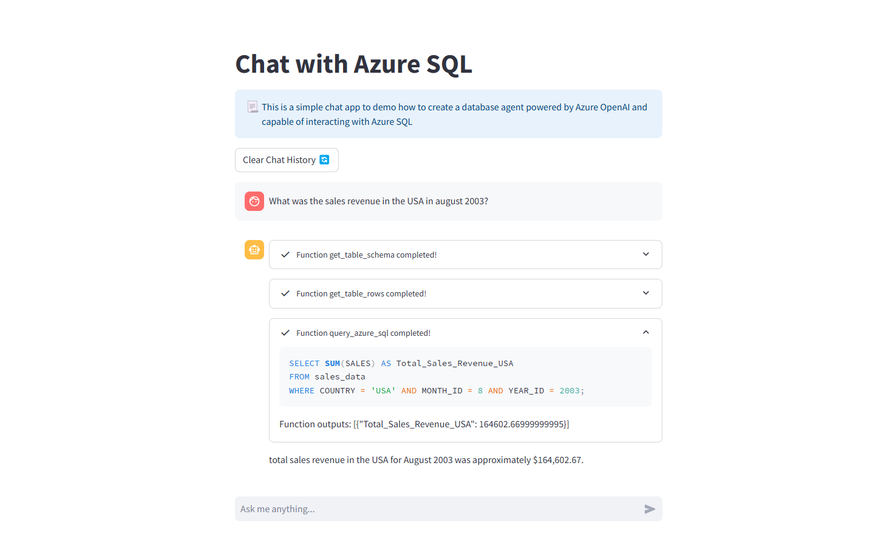

# Azure OpenAI Database Agent for Azure SQL

This repo shows how to build a Database agent using Azure OpenAI, Azure SQL and Azure App service
For simplicity purposes, the application implements the agent using the OpenAI Python SDK's chat completion API and function calling. This provides extended customization possibilities as well as more control over the orchestration, prompts etc.

Read more on [Function Calling](https://learn.microsoft.com/en-us/azure/ai-services/openai/how-to/function-calling) in Azure OpenAI's documentation

**Streamlit chat frontend**



## Pre-requisites
This repo assumes you already have the following resources deployed:
1. Azure OpenAI resource and deployment (ideally GPT-4o)
2. Azure SQL Server and database with one or multiple tables

### Populate .env file with your credentials

Open the [sample.env](./sample.env) file and replace the placeholders with your Azure OpenAI and Azure SQL credentials, save the file.

## Getting started
### Option 1: Docker

The [Dockerfile](./Dockerfile) packages the application and its dependencies for easier deployment.

Build the docker image
```bash
docker build -t azure-db-agent:v1 .
```

Run the Streamlit application

```bash
docker run --rm -p 8880:8501 azure-db-agent:v1
```

Now open a browser on `localhost:8880` to use the application

### Option 2: Manual install
#### 1. Install dependencies

The scripts and app in this repo leverage the SQL Server Driver to connect to Azure SQL using ODBC, this requires you to have the driver installed in the local environment.

In order to install all dependencies, run the [odbc.sh](./odbc.sh) script
```bash
./odbc.sh
```

The Python scripts leverage a variety of libraries including the openai SDK to interact with the model, Streamlit to render the UI and SQLAlchemy to run sql statements. 
Create a virtual environment with Python 3.10 or above and run the following command:
```bash
pip install -r requirements.txt
```
#### 2. [Interactive Notebook](./notebooks/)
The [aoai-quickstart.ipynb](./notebooks/aoai-quickstart.ipynb) notebook uses sample data to create a table in Azure SQL and provides an example of using OpenAI tool calling to generate SQL code and execute it in Azure SQL based on a user input.

**This notebook is a WIP and is for debugging purposes only**

#### 3. [Streamlit Application](./streamlit-app/)

Run the Streamlit app using the following command:

```bash
streamlit run ./streamlit-app/app.py
```