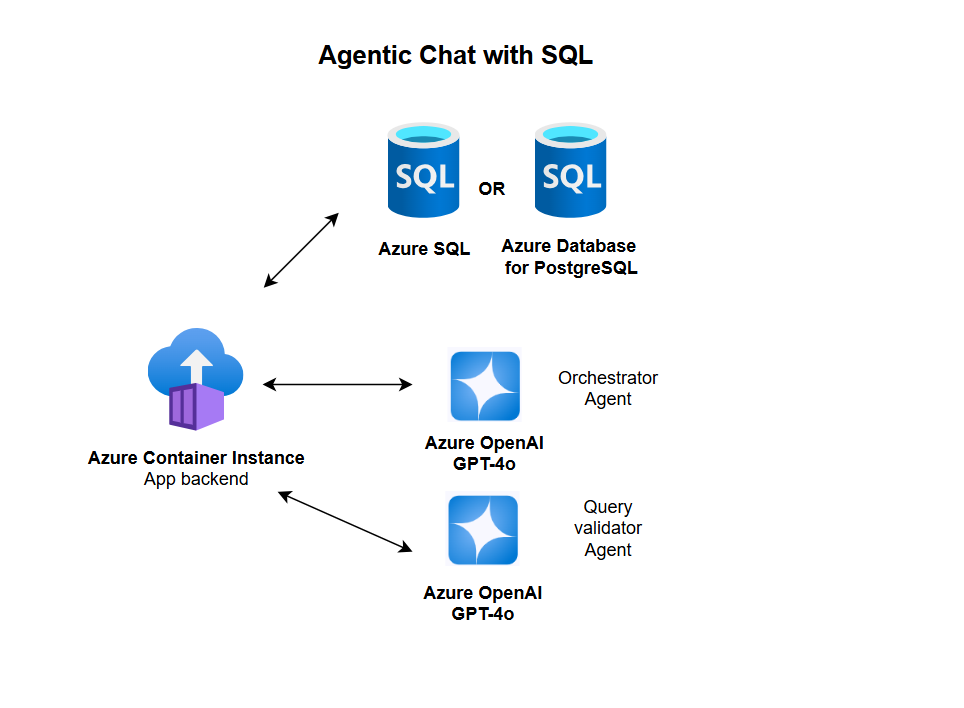
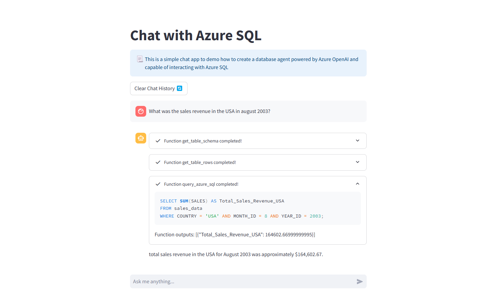

# Azure OpenAI Database Agent for Azure SQL

This repo shows how to build a Database agent using Azure OpenAI, Redshift and Azure App service
For simplicity purposes, the application implements the agent using the OpenAI Python SDK's chat completion API and function calling. This provides extended customization possibilities as well as more control over the orchestration, prompts etc.

Read more on [Function Calling](https://learn.microsoft.com/en-us/azure/ai-services/openai/how-to/function-calling) in Azure OpenAI's documentation

**Architecture diagram**


**Streamlit chat frontend**



## Pre-requisites
This repo assumes you already have the following resources deployed:
1. Azure OpenAI resource and deployment (ideally GPT-4o)
2. Azure SQL Server and database with one or multiple tables

### Populate .env file with your credentials

Open the [sample.env](./sample.env) file and replace the placeholders with your Azure OpenAI and Azure SQL credentials, save the file an name it `.env`.

## Getting started
### Option 1: Docker

The [Dockerfile](./Dockerfile) packages the application and its dependencies for easier deployment.

Build the docker image
```bash
docker build -t azure-db-agent:v1 .
```

Run the Streamlit application

```bash
docker run --rm -p 8880:8501 azure-db-agent:v1
```

Now open a browser on `localhost:8880` to use the application

